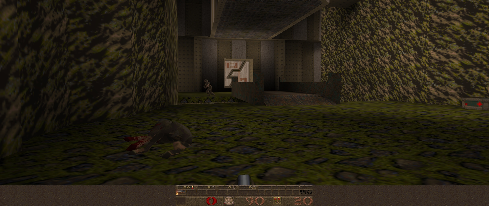

# SharpQuake

  
 

 
 
### Description 

 **[SharpQuake](https://memorix101.itch.io/sharpquake)** is a **[GLQuake](https://github.com/dpteam/GLQuake3D)** reimplementation in C# using the **[OpenTK](https://github.com/opentk/opentk)** library and the **[.NET Core](https://dotnet.microsoft.com/download)** platform.

### Roadmap

- Code cleanup:
	* [ ] Change Init / Shutdown pattern for IDisposable pattern **(Ongoing)**
	* [ ] Move type definitions out of core code and into a Framework library **(Ongoing)**
	* [ ] Use PascalCase for properties, fields, function names, class names & structs **(Ongoing)**
	* [ ] Use inheritance and polymorphism where classes handle multiple object types **(Ongoing)**
	* [ ] Use camelCase for local variables **(Ongoing)**
	* [ ] Rename type definitions to .NET style variations **(Ongoing)**
	* [ ] Support for external map textures **(Ongoing)**
	* [ ] Adapt mesh routines to use Vertex and Index buffers
	* [ ] Refactor into a structure similar to Quake 3 (cgame, game, quake3, ui)  
	* [X] ~~Add 16:9, 16:10 and 21:9 support~~
	* [X] ~~Add PK3 (ZIP) support~~
	* [X] ~~Convert static classes to instance classes where static is unnecessarily used~~
	* [X] ~~Remove code duplication via file loading and handling in many non-filesystem related classes~~
	* [x] ~~Abstract OpenGL code from core engine code~~
	
- Features planned:
	* [ ] Port geometry rendering to a GLSL shading system
	* [ ] Implement central messaging system like those in engines like idtech3 and idtech4
	* [ ] Add support for Quake 3 BSPs and potentially Quake 3 shaders
	* [ ] Upgrade lighting system/introduce Normal Map and specular map support
	* [ ] Add support for MD3 and more modern model formats
	* [ ] Develop configurable UI system *(Similar to FAKK2/MOHAA)*

- Maybe if we're lucky *(Would be nice)*:
	* [ ] Port q3map compiler to C# .NET *(Why? Why not?)*
	* [ ] Implement PBR and custom BSP format *(With light mapping like Bakery - GPU Lightmapper for Unity)*
	- [ ] Make it possible to run [mod episodes](https://www.moddb.com/mods/its)

- Please take a look into this
	- [x] Cleanup and restructure/modernise the code (Thanks to [optimus-code](https://github.com/optimus-code))
	- [ ] Server browser doesn't update connected player count (in some scenarios like crashes ...)
	- [ ] Add [MonoKickstart](https://github.com/OutOfOrder/MonoKickstart) for Unix platforms
	- [x]  Music playback for mission packs not working correctly
	- [ ] [Try to make this playable on Mac](https://youtu.be/DmpmJJADJw8) ([OpenGL is broken/deprecated there](https://developer.apple.com/macos/whats-new/)) 😕
	- [ ]  Make model animations more smooth

### Dependencies
* OpenTK 3.3.1
* NVorbis 0.10.1
* **[OpenAL](https://www.openal.org/downloads/)** (Windows) / libopenal on Linux
* **[SDL2](https://www.libsdl.org/download-2.0.php)** (Windows and macOS) / libsdl2-2.0 on Linux (Runtime binaries)
  
### Building

**Project is built against and tested for Visual Studio 2019 on .NET 4.7.2**

1) **Add the OpenTK nuget package with the package manager console in Visual Studio.**
    - `Install-Package OpenTK -Version 3.3.1`
    - `Install-Package NVorbis -Version 0.10.1`
    - `Install-Package NVorbis.OpenTKSupport -Version 1.4.0`
	- `Update-Package –reinstall`

2) **Initialize git submodules**

3) **Add dependencies for your target architecture in your output directory (defaults to `<project root>/Quake`).**
    - See links under dependencies header above
4) **Add ld1, hipnotic, and rogue (minimum ld1) data directories to `<project root>/Quake`.**
    - You only need the `<mod>\pak0.pak`, etc. and `<mod>\config.cfg` files of each directory if copying from a steam install.

5) **Build solution.**

### Running

In case you don't own a copy of Quake you can purchase it on **[GOG.com](https://www.gog.com/game/quake_the_offering)**, **[Steam](https://store.steampowered.com/app/2310/QUAKE/)** or use the **[shareware version](https://community.pcgamingwiki.com/files/file/411-quake-shareware-pak/)**.

**As Linux is case-sensitive make sure your folder and file names look like that `Id1` and `PAK0.PAK` and `PAK1.PAK` (in case you own the full version).**

**To play with soundtrack add it to `Id1/music` or the mission pack folder you want to play in OGG Vorbis format like this `track02.ogg`. You can get it here** **[Steam Guide](https://steamcommunity.com/sharedfiles/filedetails/?id=119489135)**

**macOS / OSX is not official supported as OpenGL on Mac is poorly supported and has been replaced in favour of their own graphics API [Metal](https://en.wikipedia.org/wiki/Metal_(API)).**

The `-basedir <directory>` switch can be used to change the default data directory. e.g. `SharpQuake.exe -basedir C:\Quake\`

`-window` switch is pre-defined in project settings, but if you change the default directory of where you want your data, you may need to add `-basedir <directory>` to `project properties > Debug > Command line arguments` 

The original expansion packs can be run using `-rogue` or `-hipnotic` switches if the data is present for it.

Original Quake switches apply and can be used.

Enjoy! 🙂

### Credits
* Made by **[yurykiselev](https://sourceforge.net/u/yurykiselev/profile/)** and **Uze** and brought to Github by **[Memorix101](https://github.com/Memorix101)**

* QuakeSharpEvolved enhancements by **[optimus-code](https://github.com/optimus-code)**

* Updated to .NET 4.7.1 and OpenTK 3.0.1 by **[Daniel Cornelius (Kerfuffles/NukeAndBeans)](https://github.com/Kerfuffles)**

* Engine additions and fixes by **[multiguy18](https://github.com/multiguy18)** and **[Memorix101](https://github.com/Memorix101)**

* Original source code on **[SourceForge.net](https://sourceforge.net/projects/sharpquake/)**
